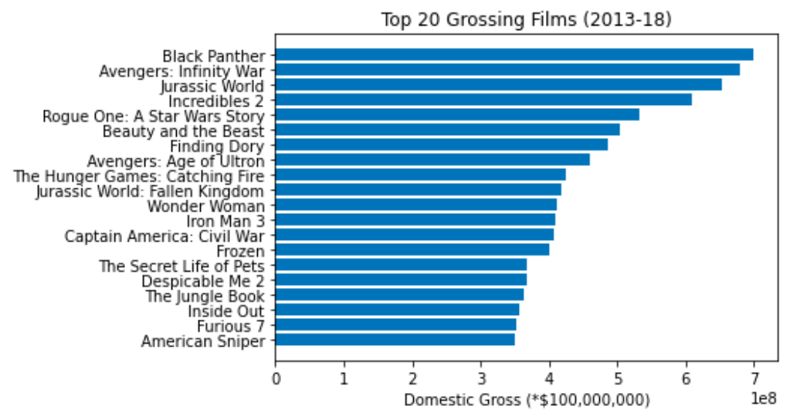
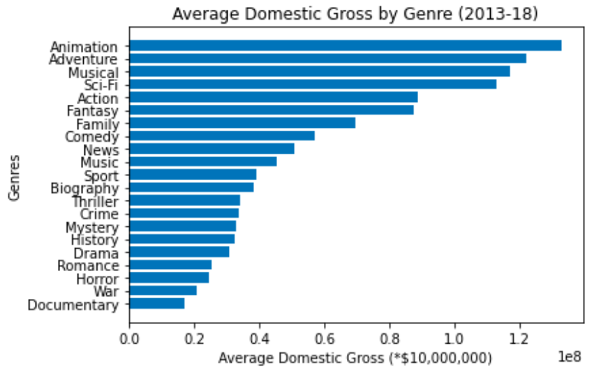
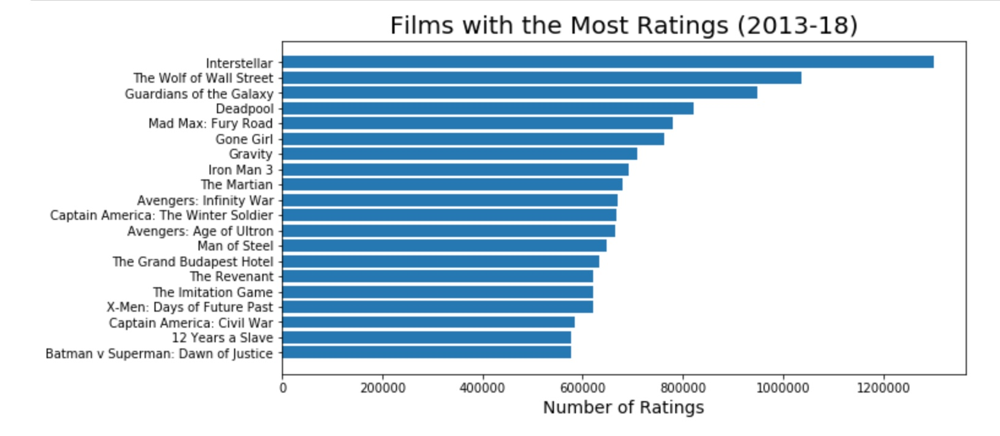
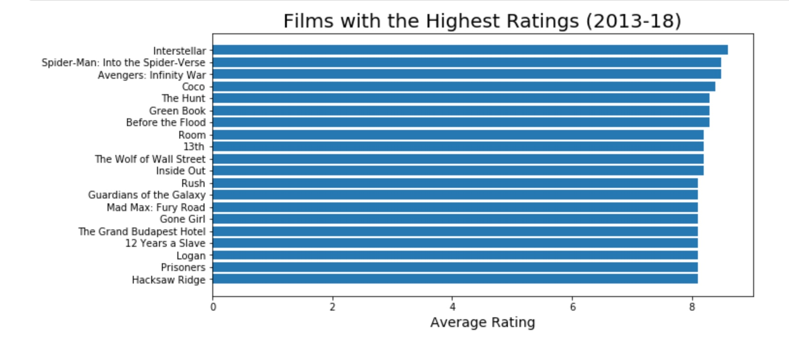
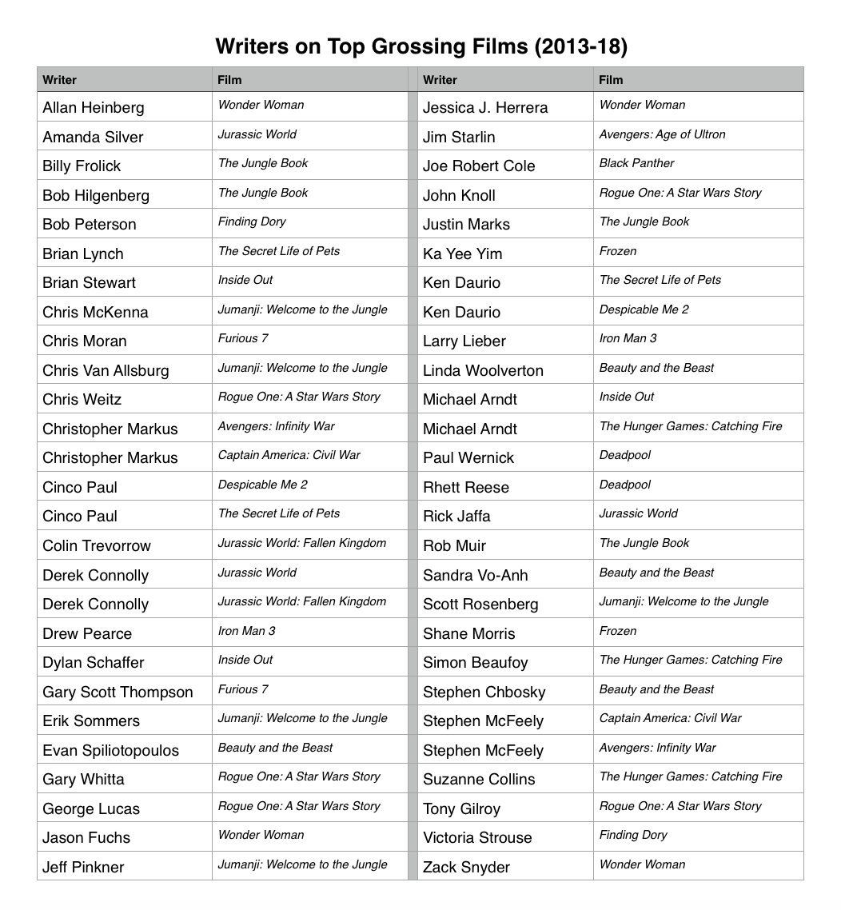

# movie-analysis-microsoft

# The Film Landscape: Examining Top Grossing and Highly Rated Films
This is a collaborative Phase 1 project completed by Joe Resis and Mark Patterson in October 2020.

## Background
In this project, we find ourselves working as consultants to the newly created Microsoft Movie Studios. We have been tasked with providing an overview of the Movie industry and providing some recommendations on how they should enter this lucrative but competitive market. We have decided to first provide a high level overview of the industry based on 3 key success metrics. These are: 

1. Financial: What movies have the highest domestic gross? 
2. Popularity: Which movies have the highest number of ratings?
3. Quality: What movies have the highest average rating? 

Through the evaluation of the titles in 3 top 20 lists we have created, we make recommendations on which genres of film Microsoft should consider exploring. 

As the "story" is the heart and soul of a film, we identify the writers that have worked on the top grossing films and proide a list of these writers as a starting point for possible partners for Microsoft to pursue. We conclude with some opportuinities for additional research. 

## Methodology
**Data:** For this project we relied upon data from IMDb and Box Office Mojo. 
* We used existing data files that were provided to us. 
* As the files are several years old, we needed to limit the date range of the data used. We decided a six year period from 2013 to 2018 would provide us adequate data. 
* As our client is interested in an initial launch only in the US, we limited the films we examined to English language only and looked just at domestic gross revenues. 

**Data Manipulation and Analysis:** exploratory data analysis, merging of files, examining descriptive statistics and plots of central tendency and dispurion, creating new columns from values in existing columns (genres, Year), and methods for dropping columns and rows to simplify analysis. 

**Output:** From our data frames we produced a series of top 20 Lists visualized with Bar charts, and a table listing the names of writers and the films they worked on.

## Insights
An important part of our analysis had to do with our findings of the 21 genres' statistics. The highest grossing genres, in terms of average domestic gross, are as follows: animation, adventure, musical, sci-fi, and action. None of these are in an oversaturated market, either, so these would all be excellent genres to get involved in. Animation and adventure films would be especially attractive, as there are relatively few companies that are vying for position near the top. In addition, Microsoft has the resources to get to the top and compete with them. We also highly recommend creating sci-fi films, as these are No. 4 in the average domestic gross rankings and would be a strong fit with Microsoft's brand.

We also observed how many films of each genre were created between the years 2013-18 in our dataset. The main purpose of this was to find any genres where the cost of getting to the top may be lower than others. Drama would be a relatively difficult genre to succeed in, based on the fact that it only ranked No. 17 in average domestic gross but was No. 1 in movies created. Genres that are not created as often include sports, history films, and documentaries. Of these, the documentary genre is the most interesting. Documentaries typically do not have a high average gross compared to other genres, but relatively few have been produced. In addition, documentaries are becoming gradually more common, so if Microsoft entered the market now, it could take advantage of a growing category that not many have tapped into. As a result, Microsoft could rise to the top more easily there compared to other genres.

As discussed, we explored multiple ways to measure success, and the highest rated genres were a different story. While dramas did not rank highly in terms of average domestic gross, they ranked No. 1 in terms of average rating, so depending on Microsoft's main objectives, they could be viable in terms of helping Microsoft achieve what it wants. Other genres that scored very well in terms of average rating were as follows: adventure, action, biography, and comedy.

Regardless of which metric is most important for Microsoft, though, writers make a significant difference with regards to films' success. If Microsoft works with writers with strong track records, it can stand out against the competition in any genre. We provide a list of the top writers on 20 of the highest grossing films. It is interestin to note that often a film may have from 2 to 5 writers. Specifically, Christopher Markus, Derek Connolly, Ken Daurio, and Stephen McFeely are especially good targets for Microsoft, as all of them have worked on multiple films since 2013 that were extremely successful based on gross and rating.

## Conclusions
With all of our analysis in mind, we have some recommendations for Microsoft as it enters this market. To summarize, we recommend that while dramas' ratings are promising, they do not make as much, on average, as other genres at the box office, and it is difficult to stand out from the many other dramas being made. Instead, consider focusing on genres like animation and adventure films, which have a high average gross and less genre competition. In addition, sci-fi's numbers are also promising, and those films could fit nicely with Microsoft's brand. Exploring niche genres and becoming a leader for sci-fi films is an attainable objective for Microsoft. As for writers, it is best to work with those having a proven track record, and we have provided a list of writers from the top grossing films. With the right writers, Microsoft could stand out in any genre, even the crowded drama genre.

It is also worth noting that financials are just one measure of success. If Microsoft wishes to go after quality (high user ratings) rather than gross, then dramas can be a good choice as are lesser earning genres like documentaries and biographies. There are quite a few measures of success, so Microsoft should prioritize which of these success measures is most important.

A long-term recommendation that goes beyond the scope of our project relates to diversity. There is an opportunity for Microsoft to be a leader in diversity and inclusion by encouraging the production by working with women and African American writers and other creators. Recruiting the top writers from underrepesented groups could go a long way and serve as a way to attract audiences and emphasize that Microsoft highly values diversity, equity, and inclusion.
